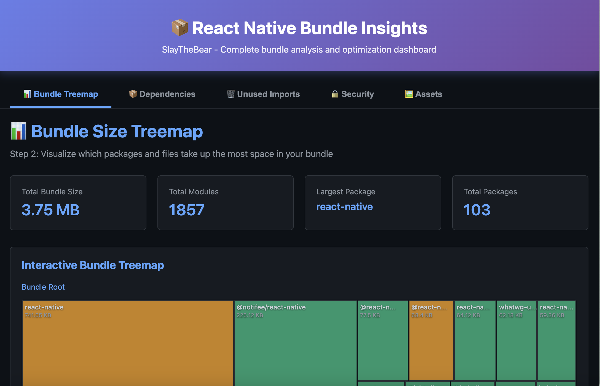
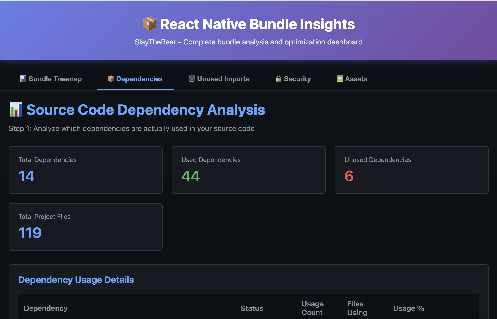
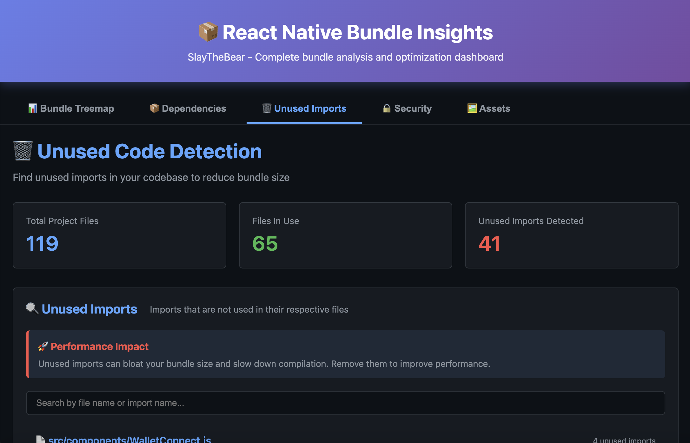
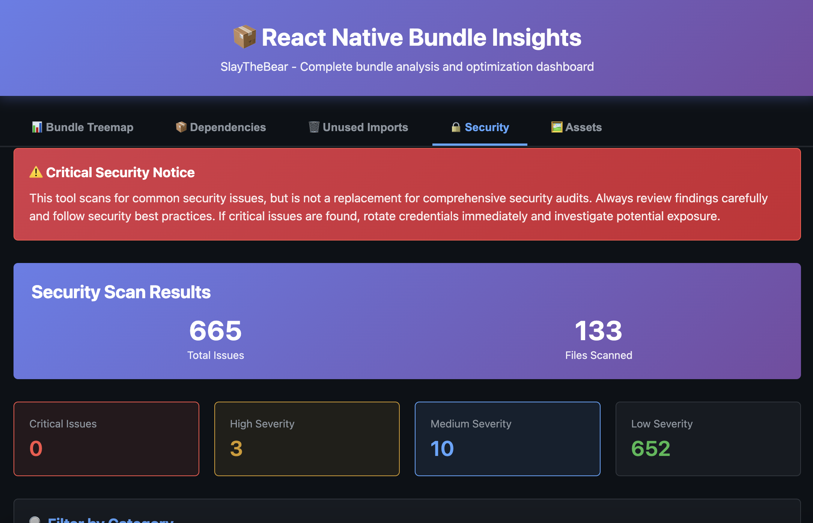
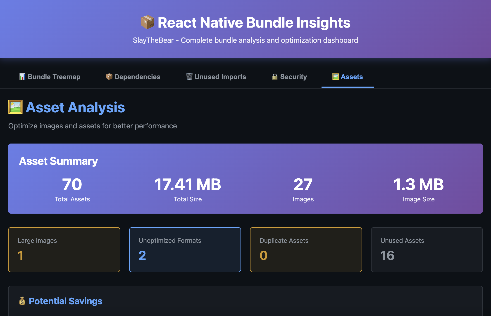

# React Native Bundle Insights

<div align="center">

**A comprehensive bundle analysis and optimization tool for React Native**

Visualize, analyze, and optimize your bundle size, security, and assets with ease!

[](https://www.npmjs.com/package/react-native-bundle-insights)
[](https://opensource.org/licenses/MIT)
[](https://www.npmjs.com/package/react-native-bundle-insights)

[Features](#features) • [Installation](#installation) • [Quick Start](#quick-start) • [Screenshots](#screenshots) • [Documentation](#cli-commands)

</div>

---

## Features

### Bundle Analysis
- 📦 **Bundle Treemap Visualization** - Interactive tree map showing module sizes
- 📊 **Package-by-Package Breakdown** - Detailed analysis of every dependency
- 🔍 **Duplicate Detection** - Find and eliminate duplicate packages

### Code Quality
- 🧹 **Unused Files Detection** - Find unused files and dependencies automatically
- 📝 **Unused Imports Detection** - Find and remove unused imports across your codebase
- 📦 **Dependency Analysis** - Visualize import chains and entry points
- 🗑️ **Dead Code Identification** - Identify potentially unused code for cleanup

### Security & Assets
- 🔒 **Security Analysis** - Detect hardcoded secrets, API keys, and PII
- 🛡️ **Security Best Practices** - Identify insecure coding patterns
- 🖼️ **Image & Asset Analysis** - Analyze image sizes, detect duplicates, suggest optimizations
- 📏 **Asset Optimization** - WebP conversion suggestions, compression recommendations

### User Experience
- 🎨 **Beautiful CLI Output** - Terminal UI with colored tables and progress bars
- 🌐 **Interactive Unified Dashboard** - Single dashboard with 5 comprehensive tabs
- 🎯 **Project Name Display** - Personalized reports with your app name
- 📈 **CI/CD Integration** - JSON export for automated tracking
- 📊 **Works Without Sourcemap** - Basic analysis works on any bundle

## Installation

```bash
npm install -g react-native-bundle-insights
# or
yarn global add react-native-bundle-insights
# or use npx (no installation needed)
npx react-native-bundle-insights --help
```

## Quick Start

### Comprehensive Analysis (Recommended)

Run all analyses at once and open the unified dashboard:

```bash
# Generate bundle first (optional - other analyses work without it)
# For iOS:
npx react-native bundle \
  --platform ios \
  --dev false \
  --entry-file index.js \
  --bundle-output ./ios/main.jsbundle \
  --sourcemap-output ./ios/main.jsbundle.map

# For Android:
npx react-native bundle \
  --platform android \
  --dev false \
  --entry-file index.js \
  --bundle-output ./android/app/src/main/assets/index.android.bundle \
  --sourcemap-output ./android/app/src/main/assets/index.android.bundle.map

# Run complete analysis
npx react-native-bundle-insights all
```

This will analyze:
- ✅ Bundle size and dependencies (if bundle exists - platform-specific)
- ✅ Source code and unused files (works for both iOS & Android)
- ✅ Security issues and best practices (works for both iOS & Android)
- ✅ Assets and images (works for both iOS & Android)

The unified dashboard will open automatically at http://localhost:8893 with all 5 tabs populated!

**Note:** The tool works with **both iOS and Android**. Most analyses (4 out of 5 tabs) work without a bundle. Only the Bundle Treemap tab requires a platform-specific bundle.

## CLI Commands

### `all` - Complete Analysis (⭐ Recommended)

Run all analyses together and open the unified dashboard.

```bash
npx react-native-bundle-insights all [options]
```

**Options:**
- `-p, --project <path>` - Project root directory (default: current directory)
- `-b, --bundle <path>` - Path to bundle file (optional)
- `-s, --sourcemap <path>` - Path to sourcemap file (optional)
- `--platform <platform>` - Platform: ios or android (default: ios)
- `--port <port>` - Port for dashboard server (default: 8893)

**Examples:**
```bash
# Run all analyses (auto-detect bundle)
npx react-native-bundle-insights all

# Specify bundle path
npx react-native-bundle-insights all --bundle ./ios/main.jsbundle

# Android project
npx react-native-bundle-insights all --platform android

# Custom port
npx react-native-bundle-insights all --port 3000
```

### `bundle-treemap` - Bundle Size Analysis

Analyze bundle size and visualize dependencies with an interactive treemap.

```bash
npx react-native-bundle-insights bundle-treemap [options]
```

**Options:**
- `-b, --bundle <path>` - Path to bundle file
- `-s, --sourcemap <path>` - Path to sourcemap file
- `--platform <platform>` - Platform: ios or android (default: ios)
- `--open` - Open web visualization (default: true)
- `--port <port>` - Port for visualization server (default: 8888)

### `unused-code` - Dead Code Detection

Find unused files, dependencies, and imports.

```bash
npx react-native-bundle-insights unused-code [options]
```

**Options:**
- `-p, --project <path>` - Project root directory
- `-e, --entry <path>` - Entry file (default: index.js)
- `--open` - Open web visualization (default: true)
- `--port <port>` - Port for server (default: 8891)

### `security` - Security Analysis

Scan for hardcoded secrets, API keys, PII, and security issues.

```bash
npx react-native-bundle-insights security [options]
```

**Options:**
- `-p, --project <path>` - Project root directory
- `--open` - Open web visualization (default: true)
- `--port <port>` - Port for server (default: 8892)

**Detects:**
- 🔴 AWS keys, Firebase keys, GitHub tokens
- 🔴 Hardcoded passwords and database credentials
- 🟡 Email addresses, phone numbers, IP addresses
- 🟠 eval() usage, disabled SSL verification
- 🟡 Console.log statements, insecure HTTP URLs
- 🟠 SQL injection risks, weak crypto algorithms

### `assets` - Asset & Image Analysis

Analyze assets, detect large images, find duplicates, and get optimization suggestions.

```bash
npx react-native-bundle-insights assets [options]
```

**Options:**
- `-p, --project <path>` - Project root directory
- `--open` - Open web visualization (default: true)
- `--port <port>` - Port for server (default: 8895)

**Analyzes:**
- 📊 Total asset count and size
- 🖼️ Large images (>200KB medium, >500KB high)
- 🔄 Duplicate assets using MD5 hashing
- ♻️ Unoptimized formats (suggests WebP conversion)
- 🗑️ Unused assets (not referenced in code)
- 💰 Potential savings calculation

## Package.json Scripts

Add these scripts to your `package.json`:

```json
{
  "scripts": {
    "bundle:ios": "react-native bundle --platform ios --dev false --entry-file index.js --bundle-output ./ios/main.jsbundle --sourcemap-output ./ios/main.jsbundle.map",
    "bundle:android": "react-native bundle --platform android --dev false --entry-file index.js --bundle-output ./android/app/src/main/assets/index.android.bundle --sourcemap-output ./android/app/src/main/assets/index.android.bundle.map",
    "analyze": "npm run bundle:ios && react-native-bundle-insights all",
    "analyze:quick": "react-native-bundle-insights all",
    "analyze:security": "react-native-bundle-insights security",
    "analyze:assets": "react-native-bundle-insights assets"
  }
}
```

Then run:

```bash
# Complete analysis with bundle generation
npm run analyze

# Quick analysis (no bundle generation)
npm run analyze:quick

# Security scan only
npm run analyze:security

# Asset analysis only
npm run analyze:assets
```

## Unified Dashboard

The interactive unified dashboard provides **5 comprehensive tabs** all in one place:

### 📊 Bundle Treemap Tab
- Interactive tree map visualization
- Drill-down by clicking on modules
- Size breakdown by package
- Hover for detailed information
- Search and filter capabilities

### 📦 Dependencies Tab
- Complete list of all imported files
- Used vs unused dependencies
- Import chain visualization
- Entry points detection
- Unused file recommendations

### 🗑️ Unused Imports Tab
- File-by-file unused import detection
- Line numbers and import statements
- Quick fix suggestions
- Potential bundle size savings
- Filter by file or import name

### 🔒 Security Tab
- **Critical Issues**: Hardcoded secrets, API keys, private keys
- **High Issues**: Passwords, JWT tokens, weak crypto
- **Medium Issues**: PII (emails, phone numbers), insecure URLs
- **Low Issues**: Console.log statements, hardcoded localhost
- Severity-based color coding
- File path and line number for each issue
- Specific recommendations for fixing
- Filter by severity or issue type

### 🖼️ Assets Tab
- **Summary**: Total assets, size, image count
- **Large Images**: Files >200KB with compression recommendations
- **Unoptimized Formats**: PNG/JPG that should be WebP
- **Duplicate Assets**: Identical files wasting space
- **Unused Assets**: Assets not referenced in code
- **Potential Savings**: WebP conversion, compression, duplicate removal
- Assets by type breakdown
- Filter by issue type

**Dashboard Features:**
- 🌓 Modern dark theme optimized for readability
- 📱 Responsive design works on all screen sizes
- 🎨 Smooth animations and transitions
- 🔍 Search and filter capabilities
- 🎯 Project name displayed in header
- ⚡ Fast loading and navigation

## Output Examples

### Terminal Output

```
📊 React Native Bundle Insights - Complete Analysis

Running all analyses...

✅ Bundle data saved
✅ Found 54 unused files, 41 unused imports
✅ Security scan complete: 665 issues found
✅ Asset scan complete: 70 assets analyzed

Opening unified dashboard with all tabs...

✅ Unified Dashboard running at http://localhost:8893
```

### Web Dashboard Tabs

All five tabs are accessible from a single dashboard:
1. **Bundle Treemap** - Visual bundle size analysis
2. **Dependencies** - Source code and import analysis
3. **Unused Imports** - Unused import detection
4. **Security** - Security vulnerabilities and best practices
5. **Assets** - Image and asset optimization

## CI/CD Integration

### GitHub Actions

```yaml
name: Bundle Analysis

on: [pull_request]

jobs:
  analyze:
    runs-on: ubuntu-latest
    steps:
      - uses: actions/checkout@v3
      - uses: actions/setup-node@v3
        with:
          node-version: '18'

      - name: Install dependencies
        run: npm install

      - name: Generate bundle
        run: npm run bundle:ios

      - name: Run complete analysis
        run: npx react-native-bundle-insights all

      - name: Upload reports
        uses: actions/upload-artifact@v3
        with:
          name: bundle-analysis
          path: .rn-bundle-analyzer/
```

## Configuration

Create a `.rnbundlerc.json` file in your project root:

```json
{
  "platform": "ios",
  "bundlePath": "./ios/main.jsbundle",
  "outputDir": ".rn-bundle-analyzer",
  "port": 8893,
  "thresholds": {
    "maxBundleSize": 5242880,
    "maxPackageSize": 524288
  }
}
```

## Tips for Optimization

### 1. Analyze Your Bundle

Use the Bundle Treemap to identify your largest dependencies. Consider replacing heavy libraries with lighter alternatives:
- **lodash** → **lodash-es** (better tree-shaking)
- **moment** → **date-fns** or **day.js** (80% smaller)
- **axios** → native **fetch API** or **ky** (smaller alternatives)

### 2. Optimize Images

Based on asset analysis results:
- Convert PNG/JPG to WebP (30-50% smaller)
- Compress large images using TinyPNG or ImageOptim
- Remove duplicate images
- Delete unused assets

### 3. Fix Security Issues

- Move hardcoded secrets to environment variables
- Use secure vaults for API keys
- Remove console.log statements from production
- Enable HTTPS for all external requests
- Use strong cryptographic algorithms (SHA-256, AES-256)

### 4. Clean Up Dead Code

- Remove unused files identified in analysis
- Delete unused dependencies
- Remove unused imports

### 5. Use Dynamic Imports

```javascript
// Instead of
import HeavyComponent from './HeavyComponent';

// Use
const HeavyComponent = React.lazy(() => import('./HeavyComponent'));
```

## Screenshots

### 📊 Bundle Size Analysis

Analyze your bundle composition and identify large packages:



---

### 📦 Dependencies Analysis

See all your dependencies, imports, and unused files at a glance:



---

### 🗑️ Unused Imports Detection

Find unused imports across your entire codebase with exact line numbers:



---

### 🔒 Security Analysis

Comprehensive security scan detecting secrets, vulnerabilities, and best practice violations:



**Issue Severity Levels:**
- 🔴 **Critical** - Hardcoded API keys, private keys, database credentials
- 🟠 **High** - Passwords, JWT tokens, weak cryptography
- 🟡 **Medium** - PII (emails, phone numbers), insecure URLs
- 🟢 **Low** - Console.log statements, hardcoded localhost

---

### 🖼️ Assets & Image Analysis

Analyze all your assets, find large images, detect duplicates, and get optimization suggestions:



**What it analyzes:**
- 📊 **Summary** - Total assets count and size
- 🖼️ **Large Images** - Files >200KB (medium) or >500KB (high priority)
- 🔄 **Duplicate Assets** - Identical files using MD5 hashing
- ♻️ **Unoptimized Formats** - PNG/JPG that should be WebP
- 🗑️ **Unused Assets** - Assets not referenced in your code
- 💰 **Potential Savings** - Estimated size reduction

---

## How to Capture Your Own Screenshots

Want to add screenshots to your project documentation? Here's how:

### macOS
```bash
# Full screen
Cmd + Shift + 3

# Selection
Cmd + Shift + 4

# Window
Cmd + Shift + 4, then press Space
```

### Windows
```bash
# Snipping Tool
Win + Shift + S

# Full screen
PrtScn
```

### Linux
```bash
# Use Screenshot tool or install Flameshot
sudo apt install flameshot
flameshot gui
```

### Tips for Great Screenshots
1. ✅ Use high resolution (at least 1920x1080)
2. ✅ Capture in dark mode for consistency
3. ✅ Include relevant data (not empty states)
4. ✅ Crop to show only relevant content
5. ✅ Use PNG format for better quality
6. ✅ Add annotations if needed (arrows, highlights)

---

## Troubleshooting

### Bundle Not Found

The tool works without a bundle! Only the Bundle Treemap tab requires it. Other analyses (security, assets, unused code) work independently.

To include bundle analysis:
1. Generate a bundle first using `npx react-native bundle`
2. Specify the path: `--bundle ./path/to/bundle`
3. Check the platform matches: `--platform ios` or `--platform android`

### Port Already in Use

If you get an EADDRINUSE error:
```bash
# Kill the process using the port (macOS/Linux)
lsof -ti:8893 | xargs kill -9

# Or use a different port
npx react-native-bundle-insights all --port 3000
```

### Parse Errors

If the bundle can't be parsed:
1. Ensure the bundle is a production build (`--dev false`)
2. Try regenerating the bundle
3. Check Metro bundler version compatibility

## Contributing

Contributions are welcome! Please feel free to submit a Pull Request.

1. Fork the repository
2. Create your feature branch (`git checkout -b feature/amazing-feature`)
3. Commit your changes (`git commit -m 'Add some amazing feature'`)
4. Push to the branch (`git push origin feature/amazing-feature`)
5. Open a Pull Request

## License

MIT © Noman Akram

## Support

- 🐛 GitHub Issues: [https://github.com/nomanaliakram321/react-native-bundle-insights/issues](https://github.com/nomanaliakram321/react-native-bundle-insights/issues)
- 📧 Email: nomanakram1999@gmail.com

---

Made with ❤️ by Noman Akram
